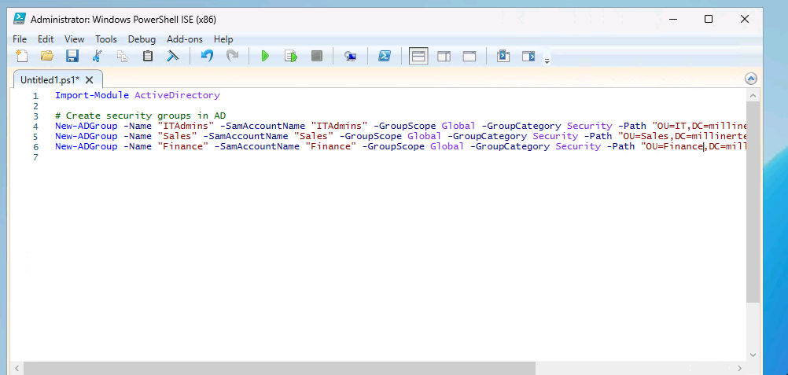

# Adding Users and Security Groups with Powershell

## 🚀 Skills Demonstrated
- Security group creation, modification, and assignment
- Bulk user import and automation using CSV files
- Organizational Unit (OU) management and user placement
- Role-based access control (RBAC) implementation for groups
- Scripting for repetitive administrative tasks to improve efficiency

---

