# Adding Users and Security Groups with Powershell

## 🚀 Skills Demonstrated
- Security group creation, modification, and assignment
- Bulk user import and automation using CSV files
- Organizational Unit (OU) management and user placement
- Role-based access control (RBAC) implementation for groups
- Scripting for repetitive administrative tasks to improve efficiency

---

### Creating CSV
Creating a csv to import new users in PowerShell.  
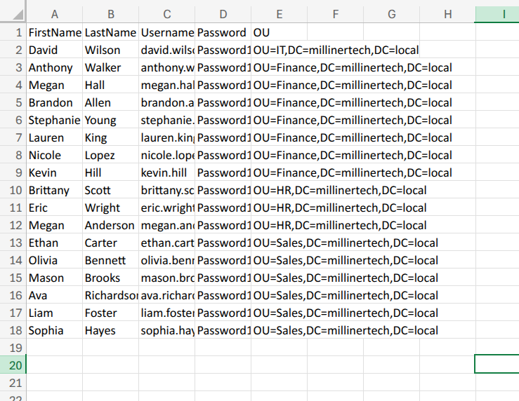   

---
---

### PowerShell Scripts
These are the scripts I used to import new users, assign them to specific OUs, and also move existing users to their deisgnated OUs.  
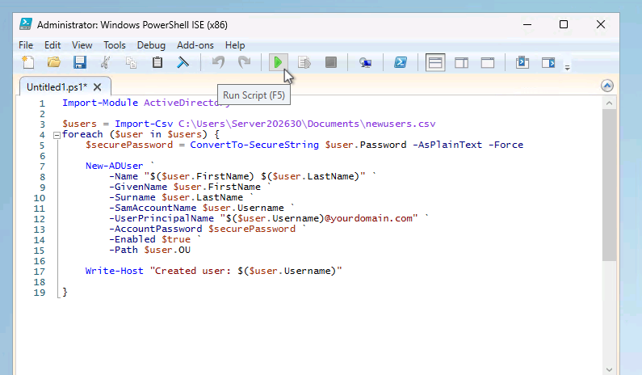
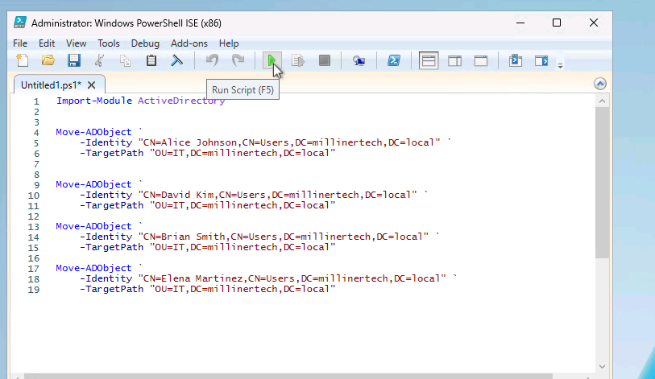   

---
---

### User OUs
Showing the finished product.  
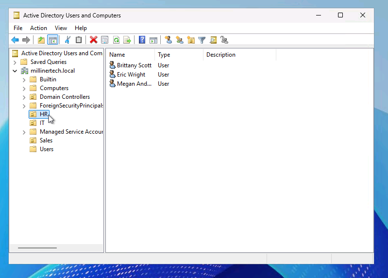
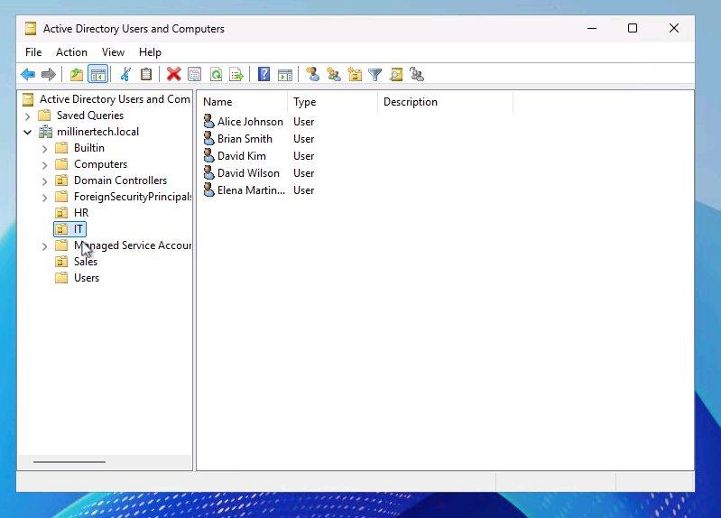
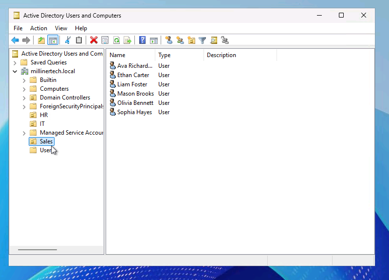   

---
---

### Security Groups
Creating security groups and assigning users to them.  
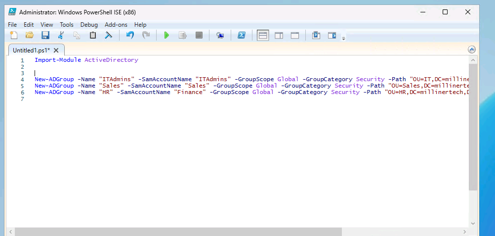
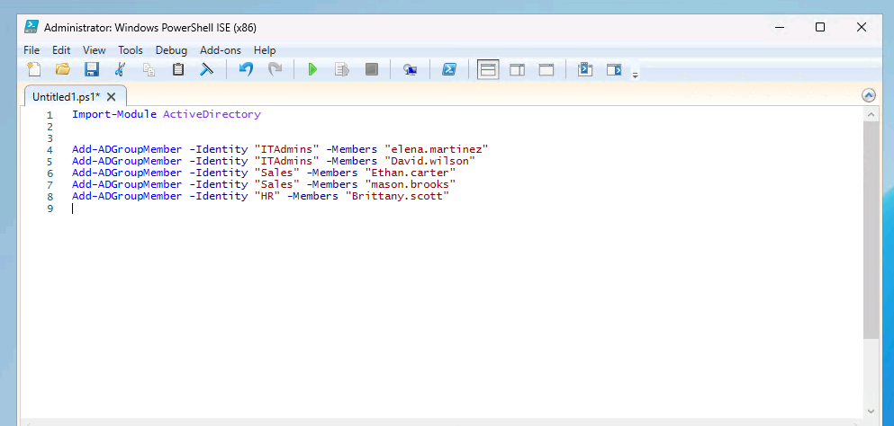   

---
---

### Adding to HR Security Group
It wouldn't let me assign "Brittany" to the HR security group through PowerShell so I thought it would be a good idea to show my knowledge of doing so in Active Directory.  
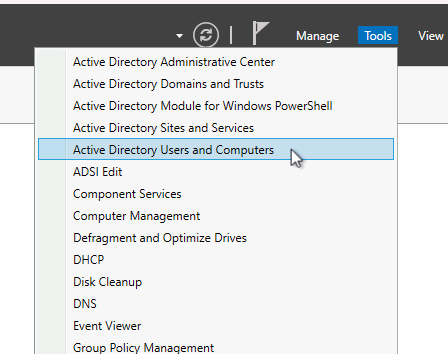
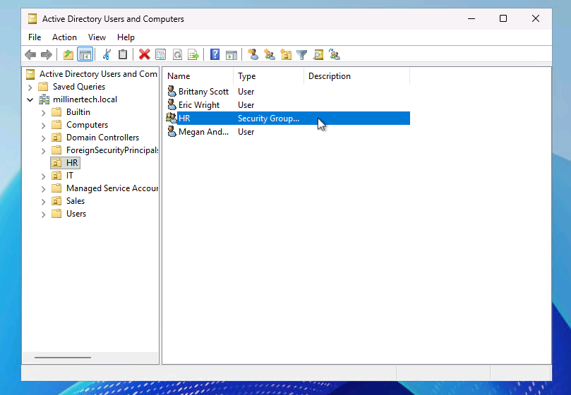
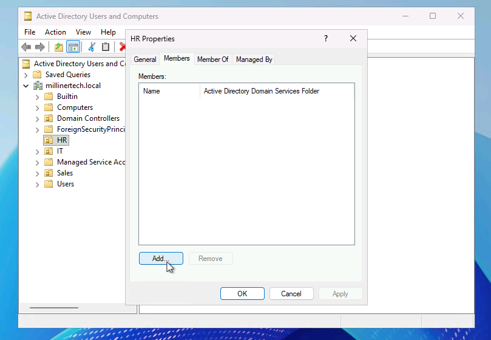
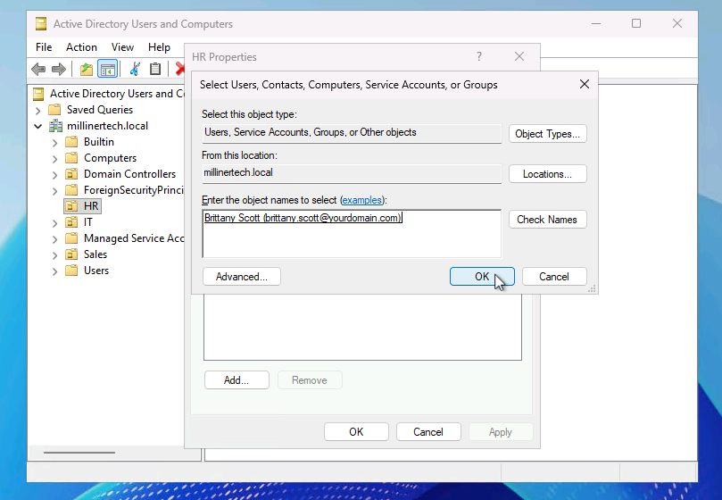   
